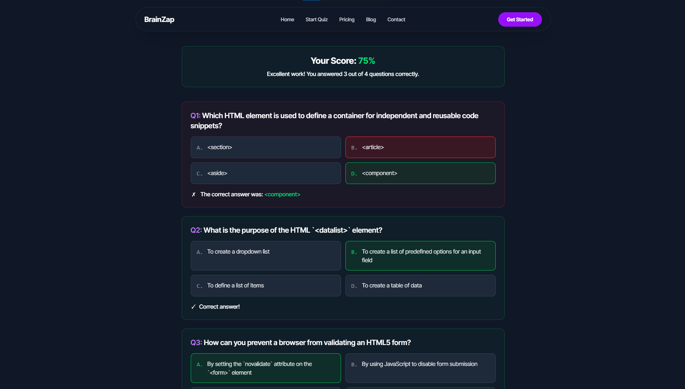

# BRAINZAP

**BRAINZAP** is an interactive, AI-powered quiz platform designed to supercharge your learning experience. Whether you're brushing up on programming skills or diving into something new, BRAINZAP adapts to your level and helps you grow — one question at a time.

---

## Features

- **AI-Generated Quizzes**: Personalized quizzes based on your chosen language and skill level.
- **Personalized Quiz Generation**: Choose your preferred programming language, difficulty level, and number of questions.
- **Progress Tracking**: Monitor your performance and improvements over time.
- **Streak System**: Stay motivated by maintaining your daily quiz streaks.
- **Quiz History**: Access and review your previously taken quizzes.
- **Smart Feedback**: Receive AI-generated feedback after completing quizzes.
- **Subscription System**: Unlock premium features through Stripe-powered subscriptions.
- **Premium Blogging**: Premium users can post blogs and share insights with the community.
- **Blog Interactions**: All users can read and like blog posts.
- **Responsive Design**: Seamless experience across desktop and mobile devices.
- **Leaderboard System**: Compete with others through global and category-specific leaderboards.
- **Social Media Sharing**: Share quiz scores and achievements directly to social platforms.
- **Printable Answer Sheets**: Print completed quiz answer sheets for offline review or documentation.
- **Achievements & Badges**: Unlock and collect achievements based on quiz performance and streaks.
- **Enhanced Quiz History**: View detailed stats and review any past quiz attempts.
- **Admin Dashboard**:
  - View total users, total revenue, and total feedback.
  - Visual analytics via graph charts.
- **Feedback Management**: Admins can view, mark as read, or delete user feedback submissions.
- **User Management (Admin Only)**:
  - Promote users to admin role.
  - Temporarily lock users (e.g., for 1 hour).
  - Permanently delete user accounts.

---

## 🛠 Tech Stack

### 🧩 Frontend

- **React.js** – Modern JavaScript library for building fast and interactive UIs
- **React Router DOM** – Client-side routing for seamless navigation
- **Tailwind CSS** – Utility-first CSS framework for rapid UI development
- **DaisyUI** – Tailwind component library for quick prototyping
- **Shadcn UI & Radix UI** – Accessible, headless component libraries for custom UI development
  - Includes Radix components like `Accordion`, `Dialog`, `Slider`, `Avatar`, `Label`, etc.
- **Framer Motion & Motion One** – Powerful libraries for smooth, performant animations
- **React Icons, Lucide React, Lottie React** – Crisp icons and animations
- **React Fast Marquee** – Customizable text animation component
- **React Toastify, SweetAlert2, React Hot Toast** – Toast and alert notification libraries
- **React Star Ratings & React Spinners** – UI components for rating systems and loading indicators
- **React Countdown & React Confetti** – Fun, interactive utilities for engagement

### 🔙 Backend

- **Node.js** – JavaScript runtime environment for backend logic
- **Express.js** – Minimal, flexible web framework for server-side routing and middleware
- **GraphQL** – Declarative data fetching with a flexible query language
- **MongoDB** – NoSQL document database for scalable data storage

### 🔐 Authentication & 💳 Payments

- **Firebase** – User authentication, hosting, and real-time database
- **Stripe.js & React Stripe.js** – Secure payment processing

### 🧰 Editor & Rich Text

- **TipTap (with extensions)** – Flexible, headless rich-text editor with code blocks, images, placeholders, alignment, and links

### ⚙️ Utilities & Dev Tools

- **Axios** – Promise-based HTTP client for API requests
- **Date-fns** – Modern JavaScript date utility library
- **Class Variance Authority (CVA) & clsx** – Class merging and conditional styling helpers
- **Tailwind Merge** – Prevent conflicting Tailwind utility classes
- **html2canvas & jsPDF** – Convert components to canvas and generate PDFs
- **React Use** – Hooks collection for better reusability

### ⚡ Development Tooling

- **Vite** – Fast and modern build tool for frontend projects
- **ESLint** – Linter to enforce code standards and catch issues early
- **@tailwindcss/vite** – Integration plugin to support Tailwind with Vite

---

## 🔍 How It Works

1. **Login to Your Account**: Log in and start taking quizzes. To unlock all premium features, purchase a subscription for full access.
2. **Personalized Quiz Generation**: Choose your preferred programming language, difficulty level, and number of questions.
3. **Take the Quiz**: Instantly receive an AI-generated quiz tailored to your inputs.
4. **Get Smart Feedback**: Review your answers with instant AI-generated feedback for each question.
5. **Track Daily Progress**: Build a streak by taking at least one quiz every day.

---

## Live Demo

Explore the live version of BRAINZAP here: [BRAINZAP Live](https://brain-zap-99226.web.app/)

---

Made by Team **CodeXplorers**
